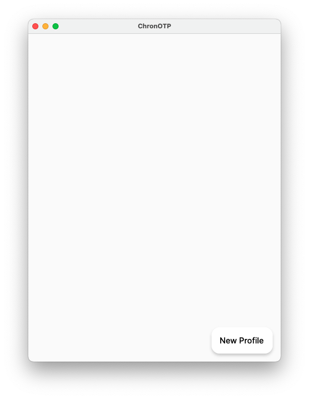
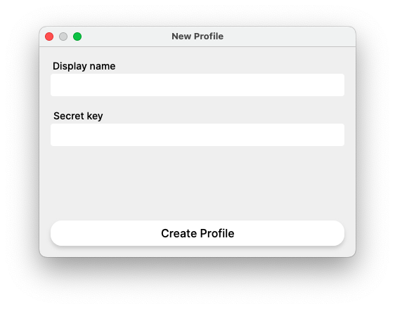
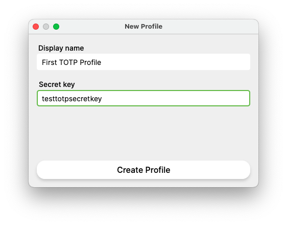
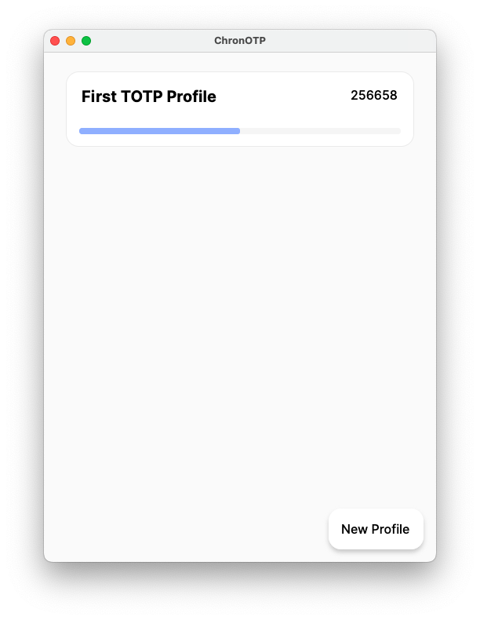

  

# ChronOTP

## How to use the application

1. Open an application. You will see empty window with one button `New profile`;

2. Click a `New profile` button. New window with new profile input form will be opened;

3. Fill the new profile form with secret key and display name of profile;

4. Click the `Create Profile` button. If everything is right, the main window will show you a list with your first TOTP profile created;

